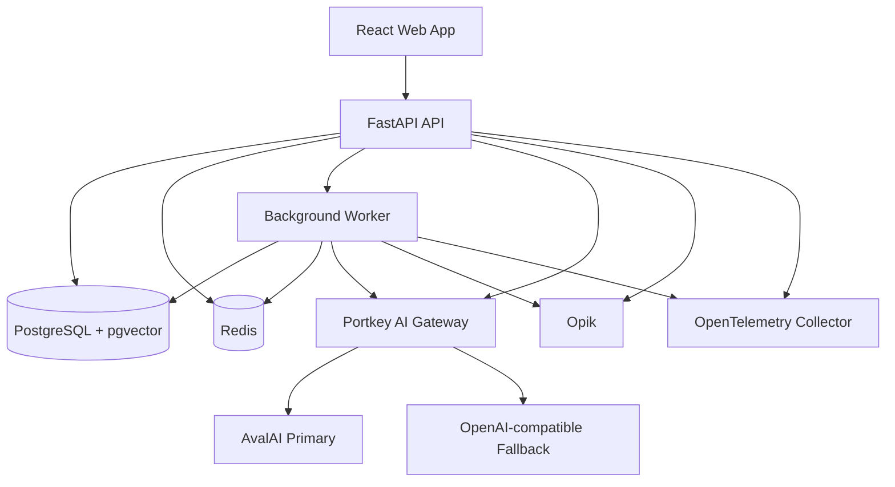

# Liara Documentation Rescue Assistant

> سند مرجع محصول، معماری و برنامه‌ی پیاده‌سازی برای مسابقه‌ی لیارا

## 1. وضعیت سند

- **نام کاری پروژه:** Liara Documentation Rescue Assistant
- **وضعیت:** آماده برای تبدیل به OpenSpec proposal/spec/design/tasks
- **مالک و مجری:** یک توسعه‌دهنده
- **زمان پیاده‌سازی:** دو روز
- **زبان اصلی محصول:** فارسی، با پشتیبانی صحیح از محتوای فنی انگلیسی و کدهای LTR
- **زیرساخت مقصد:** لیارا
- **منبع داده:** فقط مستندات عمومی لیارا
- **مخزن مستندات:** `https://github.com/liara-cloud/docs`
- **وب‌سایت مستندات:** `https://docs.liara.ir/`

این سند Source of Truth پروژه است. اگر در زمان پیاده‌سازی تصمیمی با این سند تعارض داشت، ابتدا باید سند یا OpenSpec artifacts به‌روزرسانی شوند و سپس کد تغییر کند.

---

## 2. مسئله

کاربران لیارا گاهی پاسخ سؤال خود را در مستندات پیدا نمی‌کنند؛ دلایل احتمالی:

- نمی‌دانند سؤال به کدام سرویس، runtime یا framework مربوط است.
- عبارت مورد جست‌وجوی آن‌ها با واژگان مستندات متفاوت است.
- سؤال مبهم یا چندمرحله‌ای است.
- پاسخ میان چند صفحه پراکنده است.
- پاسخ به screenshot یا تصویر پنل وابسته است.
- کاربر با Coding Agent کار می‌کند و ترجیح می‌دهد Agent مستقیماً مستندات را بخواند.
- پاسخ موردنیاز واقعاً در مستندات وجود ندارد.

یک chatbot ساده همیشه بهترین پاسخ نیست؛ زیرا هزینه‌ی inference دارد و ممکن است پاسخ ساختگی تولید کند. محصول باید کاربر را ابتدا به ارزان‌ترین مسیر قابل‌اعتماد هدایت کند و فقط هنگام نیاز از Chat/Agent استفاده کند.

---

## 3. ایده و ارزش پیشنهادی

محصول یک «سیستم نجات کاربر از بن‌بست مستندات» است، نه صرفاً یک chatbot.

کاربر سؤال خود را فقط یک‌بار وارد می‌کند و سامانه به‌ترتیب این مسیرها را در اختیار او قرار می‌دهد:

1. نمایش پرسش‌ها و پاسخ‌های مرتبط (FAQ semantic search).
2. اگر پاسخ پیدا نشد، نمایش ابزارهای نجات:
   - **بیل:** Skill قابل‌نصب برای Coding Agent.
   - **جرثقیل:** MCP متصل به مستندات زنده‌ی لیارا.
   - **هلیکوپتر:** Chat مبتنی بر bounded Agentic RAG.
3. حفظ سؤال و state هنگام جابه‌جایی بین مسیرها.
4. ارائه‌ی پاسخ مستند، مرحله‌ای و دارای citation.
5. تبدیل failureهای واقعی کاربران به داده‌ای برای تشخیص شکاف مستندات.

ارزش برای لیارا:

- کاهش سؤال‌ها و ticketهای تکراری.
- کاهش هزینه‌ی inference با FAQ، Skill و MCP.
- کشف صفحات ناقص، مبهم یا قدیمی.
- مشاهده‌ی failureها و سؤال‌های بدون پاسخ.
- ارائه‌ی تجربه‌ی سازگار با نسل جدید AI Coding Agents.

---

## 4. معیارهای داوری و اولویت اجرایی

| معیار | امتیاز | اولویت پروژه |
| --- | ---: | --- |
| کیفیت و صحت پاسخ‌ها | 80 | P0 — بیشترین تمرکز |
| UI و تجربه کاربری | 55 | P0 |
| Agentic و Personalization | 50 | P0 |
| امنیت، پایداری و Monitoring | 50 | P0/P1 |
| استقرار روی لیارا | 40 | P0 |
| بهینه‌سازی هزینه | 25 | P0 |

قاعده‌ی مدیریت زمان:

> هیچ ابزار زیرساختی یا قابلیت جانبی نباید باعث ناقص‌ماندن کیفیت پاسخ، UX اصلی، MCP، Skill یا استقرار روی لیارا شود.

---

## 5. کاربران هدف

### 5.1 توسعه‌دهنده‌ی تازه‌وارد لیارا

- نمی‌داند پاسخ در کدام قسمت مستندات است.
- احتمالاً اصطلاح دقیق لیارا را نمی‌داند.
- به پاسخ مرحله‌ای و مثال نیاز دارد.

### 5.2 توسعه‌دهنده‌ی باتجربه با سؤال فنی

- متن خطا، command یا مسئله‌ی چندمرحله‌ای دارد.
- پاسخ دقیق، کوتاه، دارای منبع و قابل‌اجرا می‌خواهد.

### 5.3 کاربر Coding Agent

- با Claude Code، Codex، Cursor یا ابزار مشابه کار می‌کند.
- ترجیح می‌دهد Agent از Skill یا MCP استفاده کند.

### 5.4 تیم پشتیبانی و مستندات لیارا

- به analytics سؤال‌های حل‌شده و حل‌نشده نیاز دارد.
- می‌خواهد شکاف‌های مستندات و هزینه‌ی سیستم را ببیند.

---

## 6. تجربه‌ی اصلی کاربر

### 6.1 صفحه‌ی ورود

- نمایش یک GIF/animation پیکسلی از آهویی که در برف گیر کرده است.
- پیام اصلی با مفهوم زیر:

  > چیزی را که می‌خواستی در مستندات پیدا نکردی؟ سؤالت را اینجا بپرس.

- یک input واضح، قابل‌دسترسی و مناسب سؤال‌های چندخطی.
- سؤال کاربر بلافاصله در یک Conversation پایدار ذخیره شود.

### 6.2 مرحله‌ی پرسش‌های مرتبط

- سؤال کاربر embedding شود.
- سؤال با مجموعه‌ی FAQ/Related Questions مقایسه شود.
- چند سؤال مرتبط همراه جواب کوتاه و لینک منبع نمایش داده شوند.
- ترتیب نتایج در ابتدا بر اساس semantic relevance و curated priority باشد.
- تا زمانی که داده‌ی واقعی نداریم، عنوان UI باید «پرسش‌های مرتبط» باشد، نه «پرسش‌های متداول».
- بعداً popularity از رفتار واقعی کاربران یاد گرفته شود.

### 6.3 اعلام حل‌شدن یا حل‌نشدن

هر پاسخ مرتبط باید این feedback را داشته باشد:

- «پاسخم را گرفتم»
- «هنوز جوابم را پیدا نکردم»

Feedback باید برای analytics و بهبود ranking ذخیره شود.

### 6.4 ابزارهای نجات

پس از انتخاب «هنوز جوابم را پیدا نکردم»، GIF/animation دوم نمایش داده شود و سه گزینه‌ی بصری ارائه شوند:

| نماد | مسیر | توضیح |
| --- | --- | --- |
| بیل | Skill | راهنمای قابل‌نصب برای Agent کاربر |
| جرثقیل | MCP | اتصال زنده‌ی Agent به مستندات لیارا |
| هلیکوپتر | Chat | کمک مستقیم داخل وب‌اپ |

متن فنی «آیا با Agent کار می‌کنی؟» در UI به زبان ساده بیان شود:

- «می‌خواهم داخل ابزارهایی مثل Claude Code، Cursor یا Codex کمک بگیرم.»
- «می‌خواهم همین‌جا پاسخ بگیرم.»

کاربر بتواند بدون نوشتن مجدد سؤال، بین Skill، MCP و Chat جابه‌جا شود و به مرحله‌ی قبل بازگردد.

### 6.5 Chat

- سؤال اولیه به‌صورت خودکار وارد Chat شود.
- Conversation history بعد از refresh و بازکردن مجدد تب باقی بماند.
- پاسخ streaming باشد.
- Markdown، code block، syntax highlighting و لینک‌ها صحیح نمایش داده شوند.
- هر code block دکمه‌ی Copy داشته باشد.
- منابع با عنوان صفحه، section، لینک و نسخه‌ی مستندات نمایش داده شوند.
- اگر chunk دارای تصویر است، تصویر مرتبط در کنار همان مرحله یا citation نمایش داده شود.
- وضعیت‌های `queued`، `retrieving`، `generating`، `retrying`، `completed` و `failed` در UI قابل‌فهم باشند.

---

## 7. دامنه‌ی نسخه‌ی مسابقه

### 7.1 قابلیت‌های P0 و اجباری

- FAQ semantic search عملیاتی.
- Chat RAG دارای citation.
- bounded Agentic RAG برای سؤال‌های پیچیده.
- سؤال تکمیلی هنگام کمبود اطلاعات ضروری.
- حفظ Conversation و سؤال اولیه بعد از refresh.
- Skill قابل‌نصب و قابل‌استفاده.
- MCP قابل‌نصب و قابل‌استفاده.
- تصاویر مرتبط در ingestion، retrieval metadata و UI.
- Portkey routing، retry، fallback و circuit breaking.
- Rate limiting، token budget و secret management.
- Opik tracing و evaluation.
- structured logging و حداقل OpenTelemetry instrumentation.
- داشبورد سبک quality/cost/failure.
- CI/CD، reindex workflow و deployment روی لیارا.
- تست‌های unit، integration و Playwright برای مسیر اصلی.

### 7.2 قابلیت‌های P1 در صورت باقی‌ماندن زمان

- Grafana dashboard کامل.
- Vision captioning انتخابی برای تصاویر ضعیف.
- semantic cache پیشرفته.
- پیشنهاد خودکار draft برای اصلاح مستندات.
- visual regression گسترده.

### 7.3 خارج از Scope مسابقه

- Self-host کامل Opik.
- Self-host embedding در production.
- Kubernetes.
- احراز هویت کامل کاربران نهایی.
- Agent آزاد و نامحدود.
- caption کردن همه‌ی تصاویر با Vision.
- چند Vector Database هم‌زمان.
- پنل مدیریت enterprise.
- auto-merge تغییرات مستندات بدون تأیید انسان.

---

## 8. معماری سطح بالا



### 8.1 سرویس‌های deployشده

1. **Web:** React production build.
2. **API:** FastAPI، REST/SSE، FAQ، Chat و MCP endpoint.
3. **Worker:** indexing و jobهای asynchronous.
4. **PostgreSQL + pgvector:** state، metadata، FAQ، chunks و vectors.
5. **Redis:** queue، locks، rate limiting، cache و وضعیت موقت streaming.
6. **Portkey Gateway:** provider routing و resiliency.

Opik در نسخه‌ی مسابقه می‌تواند hosted باشد. MCP برای کاهش تعداد سرویس‌ها در همان API ارائه شود.

---

## 9. پشته‌ی فنی

### 9.1 Backend

- Python
- FastAPI
- Pydantic Settings
- SQLAlchemy 2.x یا SQLModel با migration از طریق Alembic
- `uv` برای dependency management
- `pyproject.toml` و `uv.lock`
- Ruff برای lint و format
- Pytest برای unit/integration tests

قواعد dependency:

- `uv.lock` باید commit شود.
- CI و Docker باید از `uv sync --frozen` استفاده کنند.
- نسخه‌ی Python در `.python-version` و `requires-python` مشخص شود.

### 9.2 Frontend

- React
- TypeScript strict
- Vite
- shadcn/ui
- Tailwind CSS
- React Router یا router سبک معادل
- TanStack Query برای server state
- Markdown renderer با syntax highlighting
- Playwright برای E2E

راهنمای طراحی:

- Skill رسمی shadcn/ui برای component implementation.
- UI/UX Pro Max برای design system و UX review.
- RTL، accessibility و code blocks LTR باید مستقل و صریح تست شوند؛ به Skillهای طراحی اعتماد کامل نشود.

### 9.3 داده و زیرساخت

- PostgreSQL
- pgvector
- Redis
- Docker و Docker Compose
- GitHub Actions
- Liara deployment

### 9.4 AI

- Provider API باید OpenAI-compatible باشد.
- Primary provider: AvalAI.
- Secondary provider: configurable OpenAI-compatible provider.
- Gateway: Portkey.
- مدل Chat از environment تنظیم شود و hard-code نشود.
- مدل embedding قطعی: `text-embedding-3-large`.
- تنظیمات Chat و Embedding کاملاً جدا باشند.

```env
LLM_BASE_URL=
LLM_API_KEY=
LLM_MODEL=

EMBEDDING_BASE_URL=
EMBEDDING_API_KEY=
EMBEDDING_MODEL=text-embedding-3-large
EMBEDDING_DIMENSIONS=3072
```

اگر dimensions در Provider پشتیبانی نشود، مقدار پیش‌فرض مدل استفاده شود و dimension واقعی در index metadata ثبت شود.

---

## 10. داده‌های مستندات و هزینه‌ی embedding

بررسی اولیه‌ی مخزن فعلی:

- حدود 1,142 فایل MDX.
- حدود 7.75 MB محتوای MDX.
- حدود 2,512,904 توکن با tokenizer خانواده‌ی embedding OpenAI، پیش از پاک‌سازی.
- هزینه‌ی خام با `text-embedding-3-large` و قیمت مستقیم رسمی OpenAI حدود 0.33 دلار.
- با overlap معقول، هزینه همچنان به‌طور واضح کمتر از یک دلار است.

نتیجه:

- GPU شخصی در معماری production نقشی ندارد.
- embedding از API انجام می‌شود.
- local embedding فقط گزینه‌ی توسعه/آزمایش آینده است.

---

## 11. Ingestion Pipeline

### 11.1 مراحل

1. دریافت repository و ثبت source commit SHA.
2. شناسایی فایل‌های افزوده، تغییرکرده و حذف‌شده.
3. parse کردن MDX و حذف importها و اجزای purely presentational.
4. استخراج title، description، heading hierarchy، links، code blocks و images.
5. chunking مبتنی بر section و semantic boundaries.
6. افزودن image alt و surrounding context به متن قابل‌embedding.
7. استخراج deterministic metadata.
8. تولید embedding به‌صورت batch.
9. ساخت index version جدید.
10. اجرای smoke tests و index validation.
11. atomic activation نسخه‌ی جدید.
12. حفظ حداقل یک نسخه‌ی سالم قبلی برای rollback.

### 11.2 قواعد Chunking

- headingهای H1/H2/H3 مرزهای اصلی باشند.
- code block از توضیح بلافاصله قبل و بعد خود جدا نشود.
- Step component و تصویر مرتبط در یک logical chunk باقی بمانند.
- breadcrumb و section title به متن embedding افزوده شوند.
- chunk بیش‌ازحد کوچک یا فاقد معنای مستقل ساخته نشود.
- overlap محدود و configurable باشد.
- لینک source و anchor دقیق برای هر chunk حفظ شود.

### 11.3 Metadata هر Chunk

```json
{
  "chunk_id": "paas-python-flask-envs-03",
  "document_id": "paas-python-flask-envs",
  "title": "استفاده از متغیرهای محیطی",
  "section": "خواندن متغیر محیطی در Flask",
  "breadcrumbs": ["PaaS", "Python", "Flask", "Environment Variables"],
  "service": "paas",
  "runtime": "python",
  "framework": "flask",
  "content_type": "tutorial",
  "language": "fa",
  "code_languages": ["python"],
  "source_path": "src/pages/paas/flask/envs.mdx",
  "source_url": "https://docs.liara.ir/paas/flask/envs",
  "source_commit": "<git-sha>",
  "heading_anchor": "استفاده-از-متغیرهای-محیطی",
  "images": [],
  "indexed_at": "<timestamp>"
}
```

Metadata برای soft boosting استفاده شود. فیلتر سخت فقط زمانی اعمال شود که intent کاربر صریح و قابل‌اعتماد است.

---

## 12. راهبرد تصاویر

بررسی اولیه‌ی مخزن:

- حدود 440 image tag.
- حدود 380 image URL یکتا.
- تقریباً همه‌ی تصاویر alt دارند.
- تصاویر عمدتاً screenshot مراحل پنل، diagram یا GIF هستند.

### 12.1 رفتار پیش‌فرض

- تصویر از chunk مرتبط جدا نشود.
- `alt` و surrounding instructional text وارد متن embedding شوند.
- URL، alt، type و position تصویر در metadata ذخیره شوند.
- تصویر اصلی هنگام پاسخ در Web UI نمایش داده شود.
- MCP تصویر را به‌صورت URL + alt + structured metadata برگرداند.
- Skill به Agent بگوید تصویر مرتبط را در پاسخ حفظ کند.

### 12.2 Vision Fallback

Vision فقط در این حالت‌ها اجرا شود:

- alt خالی، گنگ یا فاقد اطلاعات است.
- سؤال ماهیت بصری دارد: «کجا کلیک کنم؟»، «این گزینه کجاست؟» و مشابه آن.

Caption تولیدشده:

- بر اساس image hash cache شود.
- فقط برای منابع allowlisted مستندات لیارا تولید شود.
- source commit و image URL را حفظ کند.

caption کردن تمام تصاویر در Scope مسابقه نیست.

---

## 13. Retrieval و FAQ

### 13.1 FAQ/Related Questions Fast Path

- مجموعه‌ای محدود از سؤال و جواب‌های مرتبط از مستندات ساخته و دستی بازبینی شود.
- query embedding با embedding سؤال‌های FAQ مقایسه شود.
- نتایج بر اساس semantic similarity و curated priority مرتب شوند.
- threshold و top-k configurable باشند.
- نتیجه‌ی ضعیف نباید به‌زور نمایش داده شود.
- success/failure feedback ذخیره شود.

Popularity در آینده از داده‌های واقعی محاسبه شود:

- impression count
- click count
- solved feedback
- unresolved feedback
- انتقال به Skill/MCP/Chat

### 13.2 Document Retrieval

Retrieval باید hybrid باشد:

- dense vector retrieval برای معنا.
- lexical retrieval برای command، service name، error code و عبارات دقیق.
- fusion نتایج با روش شفاف و قابل‌تنظیم مانند RRF.
- evidence selection/reranking پیش از پاسخ نهایی.

خروجی retrieval باید شامل score، متن chunk، metadata، images، source URL و source commit باشد.

---

## 14. Bounded Agentic RAG

Agent آزاد و عمومی ساخته نشود. Agent فقط ابزارهای allowlisted زیر را داشته باشد:

```text
search_docs(query, service?, runtime?, framework?, top_k?)
read_doc(document_id_or_url, section?)
search_related_questions(query, top_k?)
```

MCP می‌تواند ابزار کاربرمحور زیر را نیز ارائه کند:

```text
diagnose_liara_issue(service?, runtime?, framework?, stage?, error_message?)
```

### 14.1 محدودیت‌ها

- حداکثر 3 tool call برای هر turn.
- حداکثر 2 query rewrite.
- token budget مشخص.
- timeout مشخص.
- فقط مستندات allowlisted لیارا.
- citation اجباری برای ادعاهای فنی.
- در نبود evidence کافی، پاسخ ساختگی ممنوع است.

### 14.2 Clarification

Agent فقط در صورت اثرگذاری واقعی سؤال تکمیلی بپرسد؛ نمونه‌ها:

- از کدام سرویس لیارا استفاده می‌کنی؟
- runtime یا framework چیست؟
- خطا هنگام build است یا runtime؟
- متن کامل خطا چیست؟
- از Docker استفاده می‌کنی یا deployment مستقیم؟

### 14.3 پاسخ نهایی

پاسخ باید:

- مستقیم و متناسب با سطح کاربر باشد.
- مراحل قابل‌اجرا ارائه کند.
- code/commands را صحیح قالب‌بندی کند.
- منابع مرتبط را دقیق نشان دهد.
- در صورت نیاز تصویر راهنما نمایش دهد.
- قدم بعدی و روش بررسی موفقیت را پیشنهاد کند.
- عدم اطمینان یا نبود پاسخ را صریح اعلام کند.

---

## 15. Personalization

Personalization نسخه‌ی مسابقه session-based و فنی است، نه پروفایل شخصی دائمی.

```json
{
  "service": "paas",
  "runtime": "python",
  "framework": "fastapi",
  "experience_level": "beginner",
  "current_goal": "deploy",
  "deployment_mode": "docker",
  "known_error": "..."
}
```

این profile از مکالمه به‌روزرسانی شود و برای retrieval boosting، clarification و سطح توضیح استفاده شود.

---

## 16. MCP

MCP نسخه‌ی مسابقه باید واقعاً قابل‌نصب و مستند باشد.

### ابزارهای اجباری

- `search_liara_docs`
- `get_liara_doc`
- `diagnose_liara_issue`

### الزامات

- schema ورودی و خروجی دقیق.
- output شامل citation و image metadata.
- timeout و errorهای قابل‌فهم.
- rate limiting.
- نمونه‌ی config برای Claude Code/Codex/Cursor.
- smoke test با MCP Inspector یا host واقعی.
- عدم نیاز به API key لیارا برای دسترسی به مستندات عمومی، مگر برای حفاظت سرویس MCP خود پروژه.

---

## 17. Skill

Skill باید یک workflow حل مسئله باشد، نه صرفاً لینک مستندات.

Skill به Agent آموزش دهد:

1. intent و سرویس مرتبط را تشخیص دهد.
2. اطلاعات ضروری گم‌شده را از کاربر بپرسد.
3. ابتدا MCP را برای retrieval استفاده کند.
4. پاسخ را فقط بر اساس evidence ارائه دهد.
5. code و commands را قابل‌اجرا نشان دهد.
6. منابع و تصاویر مرتبط را حفظ کند.
7. در نبود evidence حدس نزند.
8. قدم بعدی و verification step پیشنهاد دهد.

Skill باید دارای README نصب، نسخه و تست نمونه باشد.

---

## 18. State، Durability و Queue

### 18.1 State پایدار

State اصلی فقط در React state یا Local Storage نگهداری نشود.

جداول/موجودیت‌های اصلی:

- `sessions`
- `conversations`
- `messages`
- `request_jobs`
- `feedback`
- `faq_items`
- `documents`
- `document_chunks`
- `index_versions`
- `image_assets`
- `usage_events`

کاربر ناشناس یک session ID امن در cookie داشته باشد. Conversation ID برای بازیابی history استفاده شود.

### 18.2 Job Lifecycle

```text
queued -> retrieving -> generating -> completed
queued -> retrieving -> retrying -> completed
queued -> ... -> failed
```

- سؤال قبل از enqueue در PostgreSQL ذخیره شود.
- هر درخواست idempotency key داشته باشد.
- refresh باعث ایجاد job تکراری نشود.
- job بعد از disconnect کاربر ادامه پیدا کند.
- UI پس از بازگشت، history و job status را بازیابی کند.
- SSE برای streaming و reconnect استفاده شود.

### 18.3 Queue

- FAQ search در مسیر sync و سریع باشد.
- Chat/Agent jobها در queue قرار گیرند.
- Redis برای queue/lock/cache استفاده شود.
- job شکست‌خورده پس از retryهای محدود وارد failed/dead-letter state شود.
- timeout و cancellation پشتیبانی شوند.

---

## 19. Provider Resilience

Portkey مسئول این موارد باشد:

- OpenAI-compatible gateway.
- retries با exponential backoff.
- احترام به `Retry-After`.
- provider/model fallback.
- circuit breaker.
- request timeout.
- conditional routing.
- cost/usage visibility در صورت پشتیبانی.

Retry فقط برای failureهای transient مانند timeout، 429 و 5xx انجام شود. validation/auth errors بدون retry fail شوند.

از retry amplification جلوگیری شود:

- retry مربوط به LLM در Gateway انجام شود.
- Worker فقط برای failure زیرساختی job retry محدود داشته باشد.

---

## 20. امنیت و کنترل هزینه

### 20.1 امنیت

- API keyها فقط در Liara Secrets/Environment Variables.
- هیچ secret در frontend یا repository قرار نگیرد.
- logs باید secret، cookie و token را redact کنند.
- rate limiting بر اساس IP و session.
- محدودیت طول سؤال و history.
- allowlist ابزارها و دامنه‌های retrieval.
- محتوای مستندات به‌عنوان data و نه instruction پردازش شود.
- prompt injection tests برای retrieved content.
- CORS محدود.
- admin dashboard محافظت شود.
- dependency و container imageها pin شوند.

### 20.2 کنترل هزینه

- FAQ fast path.
- پیشنهاد Skill/MCP قبل از Chat.
- semantic/exact cache برای سؤال‌های پرتکرار.
- token budget و tool-call limit.
- history truncation/summarization کنترل‌شده.
- context فقط از chunkهای relevant.
- embedding incremental.
- ثبت token/cost برای هر request.
- عدم ارسال تصویر به Vision مگر هنگام نیاز واقعی.

---

## 21. Observability

### 21.1 تفکیک مسئولیت

| ابزار | مسئولیت |
| --- | --- |
| Opik | LLM/RAG/Agent tracing، evaluation و cost |
| OpenTelemetry | traces، metrics و structured runtime telemetry |
| Prometheus-compatible metrics | time-series metrics |
| Grafana | visualization و alerting در صورت زمان |
| Dozzle | live Docker logs در development |
| Lazydocker | ابزار دستی توسعه‌دهنده، نه monitoring production |

### 21.2 Correlation IDs

تمام اجزا در صورت امکان این شناسه‌ها را حمل کنند:

- `trace_id`
- `session_id`
- `conversation_id`
- `job_id`
- `provider_request_id`
- `index_version`

### 21.3 Metrics اجباری

- request count، latency و error rate.
- queue depth و queue wait time.
- job success/failure/retry.
- provider fallback و circuit state.
- token usage و cost.
- cache hit rate.
- retrieval latency.
- FAQ solved/unresolved rate.
- انتقال FAQ به Skill/MCP/Chat.
- آخرین index commit و index status.
- count سؤال‌های بدون evidence.

### 21.4 Health

- `/health/live`
- `/health/ready`
- Docker health checks.
- graceful shutdown برای Worker/API.

---

## 22. Dashboard سبک مسابقه

داشبورد باید حداقل این موارد را نشان دهد:

- درصد حل‌شدن در FAQ.
- درصد انتخاب Skill، MCP و Chat.
- سؤال‌های پرتکرار حل‌نشده.
- صفحات دارای بیشترین unresolved feedback.
- تعداد و نرخ failureها.
- هزینه و token usage.
- provider fallback count.
- وضعیت آخرین indexing.
- آخرین source commit و index version.

Dashboard پیچیده‌ی enterprise لازم نیست؛ صحت داده و نمایش داستان کاهش هزینه مهم‌تر است.

---

## 23. CI/CD

### 23.1 Workflowهای پروژه

```text
.github/workflows/
  ci.yml
  e2e.yml
  rag-evaluation.yml
  docs-index.yml
  build-images.yml
  deploy.yml
```

### 23.2 CI Pull Request

Backend:

```bash
uv sync --frozen
uv run ruff check .
uv run ruff format --check .
uv run pytest
```

Frontend:

```bash
npm ci
npm run lint
npm run typecheck
npm run test
npm run build
```

UI/E2E:

```bash
npm run test:e2e
```

Playwright artifacts در failure:

- screenshot
- video در صورت فعال‌بودن
- trace archive
- console/network failure summary

### 23.3 Docs Index Workflow

چون پروژه مالک repository مستندات لیارا نیست، workflow باید:

- به‌صورت schedule و workflow_dispatch اجرا شود.
- آخرین commit SHA را با index فعال مقایسه کند.
- در صورت نبود تغییر، بدون هزینه خارج شود.
- فقط فایل‌های تغییرکرده را reindex کند.
- index جدید را قبل از activation validate کند.
- در failure نسخه‌ی قبلی را فعال نگه دارد.
- نتیجه را log و metric کند.

اگر بعداً webhook رسمی در دسترس بود، trigger webhook نیز اضافه شود.

### 23.4 Deployment

- فقط بعد از موفقیت CI.
- build imageهای immutable و versioned.
- migration کنترل‌شده.
- health/readiness check پس از deploy.
- rollback در failure.

---

## 24. قوانین Agentهای کدنویسی در Repository

فایل‌های زیر ایجاد شوند:

```text
AGENTS.md
CLAUDE.md
RULES.md
openspec/config.yaml
```

### 24.1 نقش فایل‌ها

- `AGENTS.md`: دستورهای حیاتی و canonical برای همه‌ی Coding Agentها.
- `CLAUDE.md`: import از `AGENTS.md` و فقط موارد خاص Claude Code.
- `RULES.md`: قواعد کامل معماری، workflow، تست، امنیت و Definition of Done.

نمونه‌ی `CLAUDE.md`:

```md
@AGENTS.md

# Claude Code

Read and follow RULES.md before implementation.
Use OpenSpec artifacts as the source of truth.
```

### 24.2 قواعد اجباری Agent

برای هر task:

1. OpenSpec task و acceptance criteria را بخواند.
2. قبل از تغییر، فایل‌های مرتبط را بررسی کند.
3. فقط Scope لازم را تغییر دهد.
4. test متناسب با تغییر را اضافه/به‌روزرسانی کند.
5. lint، typecheck و tests مرتبط را اجرا کند.
6. برای UI تغییرکرده Playwright اجرا کند.
7. console و network errors را بررسی کند.
8. screenshot/trace را در صورت نیاز بازبینی کند.
9. telemetry و error handling را برای مسیر جدید اضافه کند.
10. task را فقط پس از عبور acceptance criteria کامل علامت بزند.

---

## 25. Test Strategy

### 25.1 Unit Tests

- MDX parsing.
- section-aware chunking.
- metadata extraction.
- image association.
- ranking/fusion.
- citation construction.
- token budget.
- state transitions.
- retry classification.

### 25.2 Integration Tests

- PostgreSQL/pgvector retrieval.
- Redis queue و idempotency.
- Portkey primary/fallback behavior با mock provider.
- Opik/OpenTelemetry instrumentation failure نباید request اصلی را fail کند.
- index activation و rollback.
- MCP tool schemas و responses.

### 25.3 E2E با Playwright

سناریوی اصلی:

1. ورود به landing.
2. ثبت سؤال.
3. مشاهده‌ی Related Questions.
4. انتخاب unresolved.
5. نمایش سه ابزار نجات.
6. ورود به Chat با حفظ سؤال.
7. دریافت clarification.
8. دریافت پاسخ دارای code/citation/image.
9. refresh صفحه.
10. مشاهده‌ی history و state قبلی.
11. بازگشت و انتخاب MCP یا Skill.

سناریوهای failure:

- provider timeout.
- primary provider failure و fallback موفق.
- تمام providerها unavailable.
- rate limit.
- disconnect و reconnect در streaming.
- سؤال بدون evidence.

### 25.4 Responsive/Accessibility

- mobile و desktop.
- RTL صفحه و LTR code.
- keyboard navigation.
- focus states.
- semantic labels.
- contrast.
- loading/error states.

---

## 26. Evaluation

حداقل 60 سؤال curated:

| گروه | تعداد حداقل |
| --- | ---: |
| ساده و مستقیم | 15 |
| پیچیده/چندمرحله‌ای | 15 |
| دارای error message | 10 |
| مبهم و نیازمند clarification | 10 |
| بدون پاسخ یا خارج از مستندات | 10 |

برای هر سؤال:

- expected answer points.
- expected source pages.
- expected clarification behavior.
- expected abstention behavior.
- difficulty.
- service/runtime/framework tags.

معیارها:

- retrieval Recall@k.
- citation correctness.
- answer relevance.
- answer completeness.
- groundedness/faithfulness.
- hallucination/unsupported claim rate.
- clarification correctness.
- abstention correctness.
- latency.
- token/cost.

Evaluation با Opik اجرا و نتیجه‌ی baseline ذخیره شود. تغییر prompt/retrieval مهم نباید بدون مشاهده‌ی regression وارد main شود.

---

## 27. API سطح بالا

نام‌ها می‌توانند در design نهایی اصلاح شوند.

```text
POST   /api/v1/conversations
GET    /api/v1/conversations/{id}
POST   /api/v1/conversations/{id}/messages
GET    /api/v1/conversations/{id}/stream
GET    /api/v1/jobs/{id}
POST   /api/v1/jobs/{id}/cancel

POST   /api/v1/faq/search
POST   /api/v1/feedback

GET    /api/v1/skill
GET    /api/v1/mcp/config
POST   /mcp

GET    /api/v1/admin/analytics
GET    /health/live
GET    /health/ready
GET    /metrics
```

همه‌ی mutation endpointها در صورت مناسب‌بودن idempotency key بپذیرند.

---

## 28. Failure Matrix

| Failure | رفتار مورد انتظار |
| --- | --- |
| Docs sync failure | index فعال قبلی حفظ شود |
| Embedding batch failure | batch retry محدود، index جدید فعال نشود |
| Vector retrieval failure | پاسخ graceful و امکان retry؛ در صورت ممکن FAQ lexical fallback |
| Primary LLM failure | Portkey retry/fallback |
| تمام Providerها unavailable | job و سؤال حفظ شوند؛ پیام قابل‌بازیابی |
| Worker restart | job از persisted state ادامه یا safely retry شود |
| Client disconnect | job ادامه یابد؛ SSE reconnect شود |
| Duplicate submit | idempotency از job تکراری جلوگیری کند |
| Opik/OTel unavailable | request کاربر fail نشود؛ telemetry failure log شود |
| Image unavailable | متن/alt نمایش داده شود و پاسخ اصلی باقی بماند |
| No evidence | Agent abstain کند و منابع عمومی/ticket path پیشنهاد دهد |

---

## 29. برنامه‌ی اجرایی

### قسمت 1 — Foundation و Ingestion

- repository structure و OpenSpec.
- Docker Compose.
- FastAPI، React، PostgreSQL، Redis.
- uv و lockfile.
- MDX parser و metadata extraction اولیه.
- schema و migration اولیه.

### قسمت 2 — Retrieval و FAQ

- chunking text/code/image-aware.
- embedding batch با `text-embedding-3-large`.
- pgvector index.
- hybrid search و fusion.
- FAQ related questions.
- evaluation dataset اولیه.

### قسمت 3 — Chat و Resilience

- Conversation persistence.
- RAG answer با citation.
- Portkey primary/fallback.
- Opik tracing.
- SSE streaming.

### قسمت 4 — Agent، MCP و Skill

- bounded agent tools.
- clarification و technical session profile.
- MCP عملیاتی.
- Skill عملیاتی و install guide.

### قسمت 5 — UI/UX و Dashboard

- animationها و rescue flow.
- Markdown/code/source/image rendering.
- back/refresh/reconnect UX.
- responsive و RTL.
- dashboard سبک.
- Playwright happy path.

### قسمت 6 — Production Readiness و Deployment

- rate limit، cache، idempotency و queue failure handling.
- OpenTelemetry/metrics/health.
- GitHub Actions.
- docs reindex workflow.
- deployment روی لیارا.
- failure E2E tests.

### روز باقی‌مانده — فقط کیفیت و رفع اشکال

- اجرای evaluation.
- بهبود retrieval/prompt.
- رفع regression.
- آماده‌سازی سناریوی دمو.
- عدم افزودن feature جدید مگر برای blocker.

---

## 30. سناریوی دموی داوری

سؤال پیشنهادی:

> پروژه‌ی FastAPI من روی سیستم خودم اجرا می‌شود، ولی بعد از deploy روی لیارا بالا نمی‌آید.

دمو:

1. کاربر سؤال را در landing وارد می‌کند.
2. Related Questions نمایش داده می‌شوند.
3. کاربر unresolved را انتخاب می‌کند.
4. سه ابزار نجات نمایش داده می‌شوند.
5. کاربر هلیکوپتر Chat را انتخاب می‌کند.
6. Chat سؤال اولیه را بدون تایپ مجدد دارد.
7. Agent می‌پرسد failure در build است یا runtime و متن log چیست.
8. Agent چند retrieval انجام می‌دهد.
9. پاسخ مرحله‌ای، command، citation و تصویر مرتبط نمایش داده می‌شود.
10. کاربر refresh می‌کند و Conversation حفظ می‌شود.
11. همان سؤال با MCP داخل Coding Agent پرسیده می‌شود.
12. داشبورد trace، هزینه، fallback و مسیر حل را نشان می‌دهد.

---

## 31. Definition of Done

پروژه برای تحویل آماده است وقتی:

- مسیر اصلی FAQ -> Rescue Choice -> Chat بدون خطای blocker کار کند.
- MCP و Skill با حداقل یک Agent واقعی تست شده باشند.
- پاسخ‌ها citation دقیق و قابل‌کلیک داشته باشند.
- no-evidence behavior پاسخ ساختگی تولید نکند.
- Conversation بعد از refresh حفظ شود.
- provider fallback در یک تست قابل‌نمایش کار کند.
- rate limiting و secret management فعال باشند.
- Opik حداقل retrieval و LLM spans را نمایش دهد.
- health endpoints و metrics در deployment در دسترس باشند.
- CI سبز باشد.
- Playwright happy path و failureهای اصلی را پاس کند.
- reindex workflow نسخه‌ی جدید را بدون خراب‌کردن index قبلی بسازد.
- پروژه روی زیرساخت لیارا deploy شده باشد.
- README شامل setup، architecture، environment variables، deployment و demo باشد.

---

## 32. ریسک‌ها و کاهش ریسک

| ریسک | کاهش ریسک |
| --- | --- |
| Scope زیاد برای یک هفته | P0/P1/Out-of-Scope و vertical slices محدود |
| کیفیت ضعیف retrieval فارسی | hybrid retrieval، metadata، curated evaluation |
| hallucination | citation اجباری، bounded tools، abstention |
| تفاوت OpenAI-compatible providers | capability tests و Portkey adapter |
| failure هنگام deploy | health check، rollback و persisted jobs |
| UI جذاب ولی ناکارآمد | Playwright، code/source UX و accessibility |
| تصاویر بدون context | alt + surrounding text + metadata + selective Vision |
| telemetry بیش‌ازحد پیچیده | Opik + حداقل OTel؛ Grafana کامل P1 |
| نبود داده‌ی FAQ واقعی | عنوان «پرسش‌های مرتبط» و feedback loop |

---

## 33. تصمیم‌های قطعی

- Backend: FastAPI.
- Frontend: React + TypeScript + Vite + shadcn/ui.
- Python dependencies: uv + committed lockfile.
- Embedding: `text-embedding-3-large`.
- Embedding production از API؛ GPU شخصی خارج از production.
- Chat/Embedding APIها OpenAI-compatible و قابل‌تنظیم.
- Gateway: Portkey.
- Primary AI provider: AvalAI.
- Observability LLM/RAG: Opik.
- Runtime telemetry: OpenTelemetry.
- State: PostgreSQL.
- Vector store: pgvector در PostgreSQL برای کاهش تعداد سرویس‌ها.
- Queue/cache/rate limit: Redis.
- Chat: bounded Agentic RAG، نه Agent آزاد.
- تصاویر: metadata + alt/context embedding + selective Vision fallback.
- CI/CD: GitHub Actions.
- مقصد deployment: Liara.
- زمان: کمتر از یک هفته، یک توسعه‌دهنده.
- MCP، Skill، Chat، FAQ و dashboard همگی باید در دمو عملیاتی باشند.

---

## 34. تصمیم‌های Configurable یا هنوز باز

این موارد implementation blocker نیستند و باید از environment/config قابل‌تغییر باشند:

- مدل Chat اصلی AvalAI.
- Provider و مدل fallback.
- chunk size و overlap.
- FAQ similarity threshold و top-k.
- retrieval top-k و fusion weights.
- reranking strategy.
- token budget و timeout.
- rate limit thresholds.
- cache TTL.
- Vision model برای fallback.
- Grafana hosted/self-hosted در صورت اجرای P1.

---

## 35. منابع اصلی

- Liara Docs Repository: `https://github.com/liara-cloud/docs`
- Liara Documentation: `https://docs.liara.ir/`
- OpenSpec: `https://github.com/Fission-AI/OpenSpec`
- Opik: `https://github.com/comet-ml/opik`
- Portkey Gateway: `https://github.com/portkey-ai/gateway`
- shadcn/ui LLM Index: `https://ui.shadcn.com/llms.txt`
- UI/UX Pro Max: `https://github.com/nextlevelbuilder/ui-ux-pro-max-skill`

